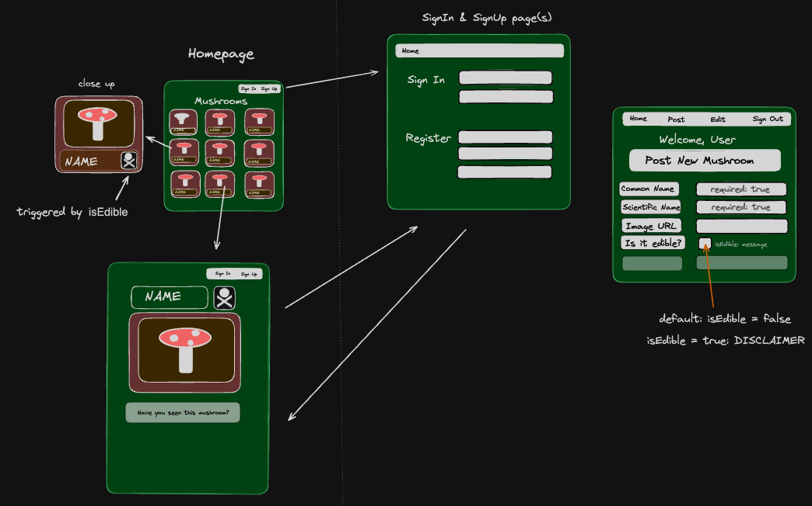
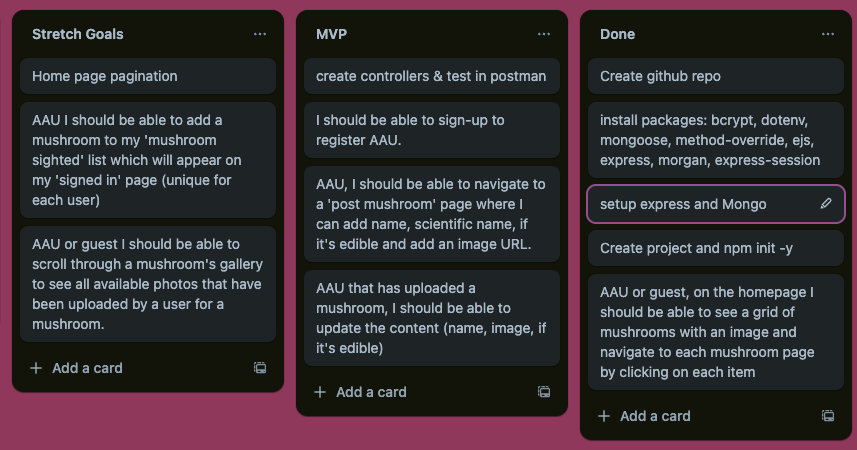

# MYCO-PROJECT

_Disclaimer: Please don't rely on the data in the page if you're considering eating the mushrooms. Certain mushrooms can be easily confused with deadly consequences._

## Inspiration

I like nature and wanted to do something that reflected the parts of nature that I enjoy. Having built a smaller test CRUD app based on Bryophytes (Mosses, Liverworts and Hornworts) I thought that creating an app for mushrooms would be a nice complement.

## Overview

This is a simple CRUD database relating to mushrooms. You can upload, edit and delete your own mushrooms and you can view those made by others. You do not have permissions to delete other people's mushrooms unless you are signed in higher level permissions.

I enjoyed creating the project and it was my first attempt at making a CRUD app that implemented using different routers, rather than having everything on one server.js page.

I spent quite a lot of time on the visal side of the app as I wanted it to draw more attention than just being a standard CRUD database. There's a not-so-hidden easter egg feature that can be viewed if you look at some of the code or navigate to some of the pages. See if you can find it! 🍄


## Software / Dependencies

EJS
Javascript
HTML
CSS


Middleware: for database and cryptography, "node", "express", "express-session", "dotenv", "ejs", "method-override", "morgan"


## Accreditations

Photos from the seedData come from [wildfooduk.com](www.wildfooduk.com)

Skull-bones icon from [freepik.es](https://www.freepik.es/)

Mushroom Background picture from [freepik.es](https://www.freepik.es/)


## Planning 

Original plan/whiteboarding



The planning stages




## Future Updates

* Small updated that are required:
    * adding more to the footer bar, e.g. contact information
    * adding a high contrast mode
    * adding a night mode
    * the ability to upload pictures, rather than relying on URLs
    * updating the User and Mushroom schemas to include more data:
        * identifying tips
        * spotted locations
        * preferred biomes and climates
        * tasting notes

* Error handling improvements

* The ability to add multiple mushroom images should be a key feature to 'identification' side of the app. If you are mushroom spotting/picking then you need to be aware of different visual aspects of the mushroom, sometimes including the colour once bruised or inside the stipe (stem) or other parts of the mushroom. Unfortunately this was out of scope for this project.

* One feature that I wanted to implement but did not have time to was pagination. Something that would overall benefit the UI, UX and performance - although at this stage it doesn't noticeably impact the latter.

* "Myco-Basket" a feature where you can 'add' mushrooms to your basket if you've seen them out in the wild / would like to add them to a wishlist.


## Code Snippets

Here you can see an example of the reduced server.js file. Excluding the middleware and port listening, this is most of what's in there:

```
app.use(express.static(path.join(__dirname, "public")));

app.use(passUserToView);

app.get("/", async (req, res) => {
  try {
    const mushroom = await Mushroom.find();
    res.render("index.ejs", {
      mushroom,
    });
  } catch (error) {
    res.send(500, "Data not found");
  }
});

app.use('/auth', authRouter);
app.use('/mushrooms', mushroomRouter);


app.get("*", function (req, res) {
  res.render("error.ejs", { error: "Go back, page not found!" });
});
```


Thank you for reading and taking a look!

```
            ___
   T       /     \
   H      / O  O  \
   A     {  ----'  }
   N       /'| |'\
   K         | | 
            | |
            / \
/ ////  / / / / /// / \ \
```

