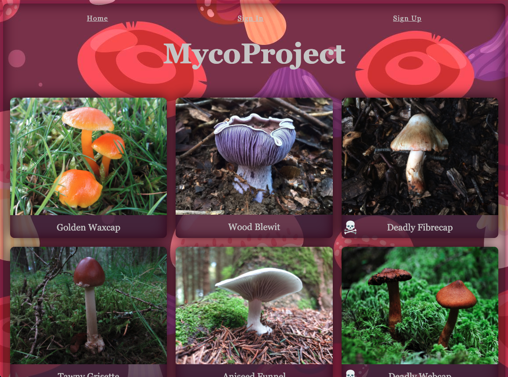
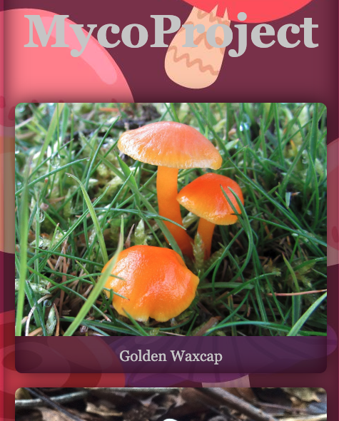
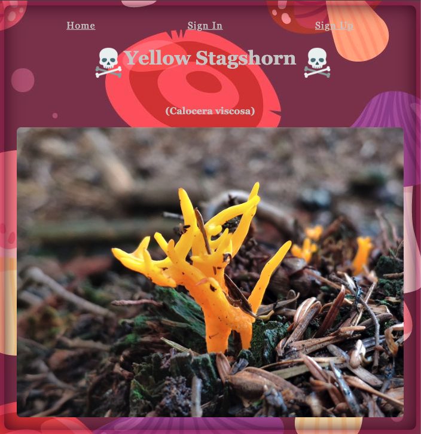
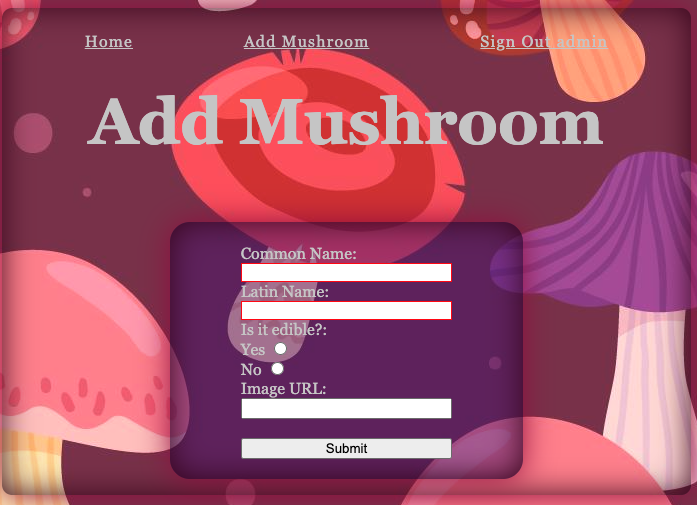

# MYCO-PROJECT

Disclaimer: Please don't rely on the data on this website if you're considering eating any of the featured mushrooms!
## Inspiration

I built a test CRUD app for [Bryophytes](https://github.com/Polynomial-B/bryophytes-lab) and I wanted to create something similarly nature-aligned. Although I have no knowledge of mushrooms, I thought this would be an interesting project to undertake.

## Overview

This is a CRUD database relating to mushrooms. You can upload, edit and delete your own mushrooms and you can view those made by others. You do not have permissions to delete other people's mushrooms unless you are signed in with administrator permissions.

I enjoyed creating the project and it was my first attempt at making a CRUD app that implemented using different routers.

There's an easter egg that can be seen if you navigate to some of the pages. 🍄

## Screenshots

### Homepage

For larger screens, it would render more like this:



For smaller screens, it would render like this:



### Showpage for each mushroom

Each mushroom page looks similar to this:



### 'Add New' page

This is where a new entry can be added:



## Software / Dependencies

- EJS
- Javascript
- HTML
- CSS
- Bcrypt
- MongoDB
- Mongoose
- Node.js
- Dotenv

## Accreditations

Photos from the seedData come from [wildfooduk.com](www.wildfooduk.com)

Skull-bones icon from [freepik.es](https://www.freepik.es/)

Mushroom Background picture from [freepik.es](https://www.freepik.es/)

## Planning

Original plan/whiteboarding


The planning stages


## Future Updates

- Each mushroom card on the homepage should be a hyperlink wherever it is clicked, currently the hyperlink is only on the mushroom's name. This would help improve UX, especially for smaller device use.

- Small updated that are required:
  - change colour of font or add background, so that the header text is always visible, no matter the size of the screen (at some sizes the colour of the text is similar to that of the background mushroom)
  - adding more to the footer bar, e.g. contact information
  - adding a high contrast mode
  - adding a night mode
  - the ability to upload pictures, rather than relying on URLs
  - updating the User and Mushroom schemas to include more data:
    - identifying tips
    - spotted locations
    - preferred biomes and climates
    - tasting notes

- Stylistically I included a hazard sign (see assets/skull-bones...) that may not have practical application for a publicly available app as it isn't that clear it signifies a 'hazard'.

- The ability to add multiple mushroom images should be a key feature to 'identification' side of the app. If you are mushroom spotting/picking then you need to be aware of different visual aspects of the mushroom, sometimes including the colour once bruised or inside the stipe (stem) or other parts of the mushroom. Unfortunately this was out of scope for this project.

- One feature that I wanted to implement but did not have time to was pagination. Something that would overall benefit the UI, UX and performance - although at this stage it doesn't noticeably impact the latter.

- "Myco-Basket" a feature where you can 'add' mushrooms to your basket if you've seen them out in the wild / would like to add them to a wishlist.

## Code Snippets

Here you can see an example of the reduced server.js file. Excluding the middleware and port listening, this is most of what's in there:

```

app.get("/", async (req, res) => {
  try {
    const mushroom = await Mushroom.find();
    res.render("index.ejs", {
      mushroom,
    });
  } catch (error) {
    res.send(500, "Data not found");
  }
});

app.use('/auth', authRouter);
app.use('/mushrooms', mushroomRouter);


app.get("*", function (req, res) {
  res.render("error.ejs", { error: "Go back, page not found!" });
});
```

Some of the code that renders each mushroom page:

```
<div class="main-container" id="<%=foundMushroom.scientificName.includes("Psilocybe") ? "special-id" : "" %>">
    <%- include('../partials/nav') %>
      <h1 class="show-header">
        <% if(!foundMushroom.isEdible) { %>
          <div id="toxic-symbol-show"> </div>
          <%= foundMushroom.commonName %>
            <div id="toxic-symbol-show"></div> %>
            <% } else { %>
              <%= foundMushroom.commonName %>
                <% } %>
      </h1>
      <h2>
        (<%= foundMushroom.scientificName %>)
      </h2>
      <div class="show">
        <% if ( foundMushroom.image !=="" ) { %>
          " alt="<%= foundMushroom.commonName%> close-up">
          <% } else { %>
            <em style="color: rgb(34, 98, 59)">No image currently available.</em>
            <br>
            <br>
            <br>
            <% } %>
      </div>
```

## Bugs

You can add multiple mushrooms of the same name. There should be a logic check for already existing mushrooms before attempting to save to the database.
